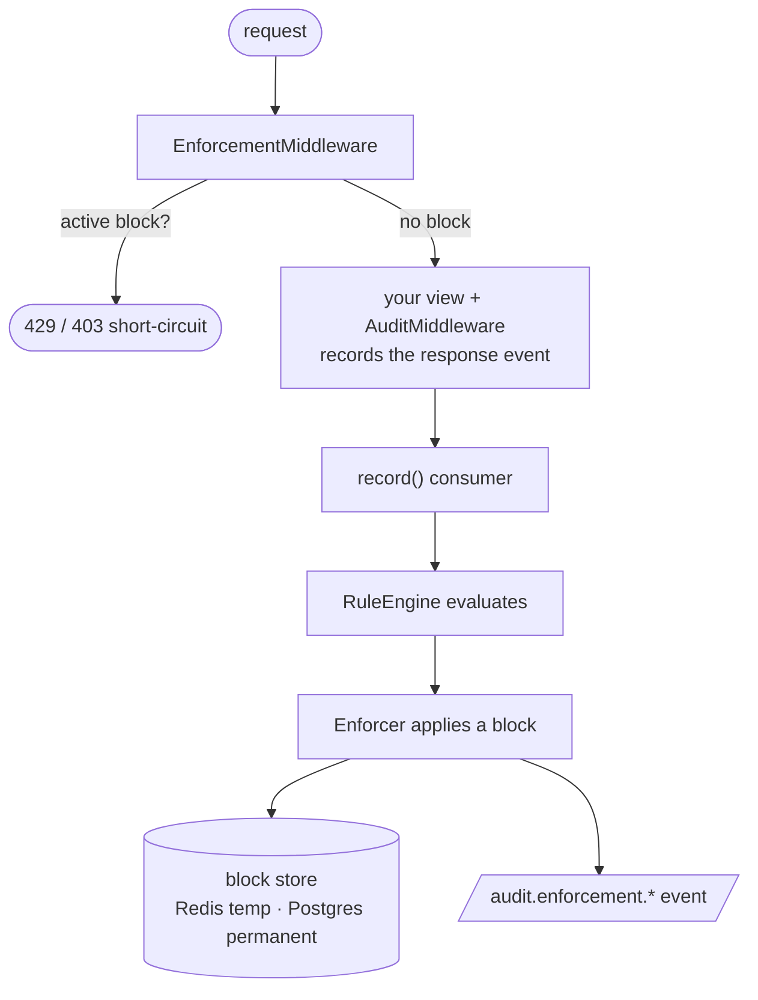

# django-sec-audit-enforcement — Documentation

The enforcement layer for [`django-sec-audit`](../../django-sec-audit). It turns
the detection brain in [`sec-audit-rules`](../../sec-audit-rules) into action:
it holds block state (temp blocks in Redis, permanent blocks in Postgres with a
Redis read-through cache), applies a matched rule's `RuleAction` as a block,
checks incoming requests against active blocks before the view runs, and emits
every enforcement decision as OTel JSONL on the existing `sec_audit.audit` logger.

> **Status:** alpha. The master switch is **off by default** — installing the
> package is inert until `SEC_AUDIT_ENFORCEMENT['enabled']` is set.

## Contents

| Doc | What it covers |
|-----|----------------|
| [Getting started](getting-started.md) | Install, `INSTALLED_APPS`/`MIDDLEWARE`, migrate, enable, verify |
| [Configuration](configuration.md) | Every `SEC_AUDIT_ENFORCEMENT` key, defaults, and `rule_actions`/`block_rules` |
| [Architecture](architecture.md) | The ingress check vs. egress detection paths, the tiered store, fail modes |
| [Custom rules](custom-rules.md) | Write your own `Rule` and register it via settings |
| [Enforcement events](events.md) | The four `audit.enforcement.*` events and their attributes |
| [Operations](operations.md) | Deploy tiers, system checks, the `PermanentBlock` model + admin, revocation, monitoring |

## How it fits together

- **Ingress** (pre-response): the middleware checks the block store and, optionally,
  runs `safe_for_enforcement` rules inline.
- **Egress** (post-response): every recorded audit event is evaluated by the rule
  engine; matches become blocks.

See [Architecture](architecture.md) for the full lifecycle.

## Requirements

- Python ≥ 3.10, Django ≥ 5.2, `< 6.1`
- `sec-audit-rules[redis]` and `django-sec-audit` (installed automatically)
- Redis for any real (multi-worker) deployment; Postgres for the durable
  permanent-block tier
