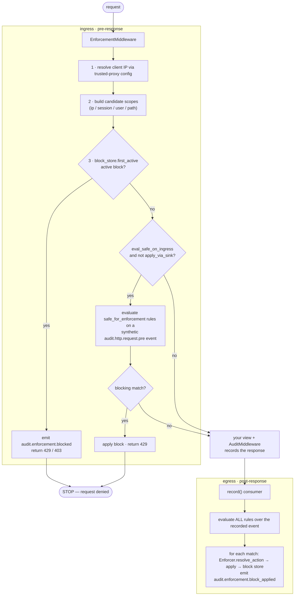

# Architecture

Enforcement has two paths: an **ingress** check that runs before your view, and
an **egress** detection pass that runs after the response is recorded. Detection
logic (the rules) lives in `sec-audit-rules`; this package is the Django wiring
that holds block state, applies actions, and short-circuits blocked requests.

## Request lifecycle

### Ingress — `EnforcementMiddleware`

Sits **above** `AuditMiddleware`. For each request it:

1. Resolves the client IP through `django-sec-audit`'s trusted-proxy resolver
   (one IP-resolution path — a spoofed `X-Forwarded-For` can't become a ban key).
2. Builds candidate `BlockScope`s from the request (ip / session / user / path).
3. Calls `block_store.first_active(scopes)`. On a hit it emits
   [`audit.enforcement.blocked`](events.md) and returns the block's status/message.
4. If no block and `eval_safe_on_ingress` is on (and not `apply_via_sink`), it
   synthesizes an `audit.http.request.pre` event and evaluates only
   `safe_for_enforcement` rules (`enforcement_only=True`) — the fast path that
   lets `login_throttle` block *before* the view runs.

`get_response` is never wrapped; only the check/apply follow the fail mode.

### Egress — the `record()` consumer

Every audit event (HTTP, auth, model) funnels through the logging runtime's
`record()`. The enforcement `consume()` consumer evaluates **all** rules over it
and applies any matches as blocks, emitting
[`audit.enforcement.block_applied`](events.md). Emitted `audit.enforcement.*`
events are on the engine skip-list, so there is **no feedback loop**.

### Ingress vs. egress: which path runs a rule?

| Rule property | Ingress (pre-response) | Egress (post-response) |
|---------------|:----------------------:|:----------------------:|
| `safe_for_enforcement = True` | ✅ (if `eval_safe_on_ingress`) | ✅ |
| `safe_for_enforcement = False` (default) | ❌ | ✅ |

Most rules run on egress. Only a cheap, side-effect-free rule you explicitly mark
`safe_for_enforcement = True` runs inline. See [Custom rules](custom-rules.md).

## The block store (tiers)

Block state is read on every request, so it lives in Redis; permanent bans also
live in Postgres for durability and the compliance trail.

| Block kind | Where it lives | Lifetime |
|------------|----------------|----------|
| **Temp** (`temp_block`) | Redis only (self-expiring `EX` key) | TTL seconds |
| **Permanent** (`persist_block`) | Postgres (source of truth) + Redis write-through cache | until revoked |

The store implementation is chosen from config at first use:

| Config | Store | Use |
|--------|-------|-----|
| no `redis_url` | `MemoryBlockStore` | dev / demo / tests (per-process) |
| `redis_url`, `permanent_tier_enabled=False` | `RedisBlockStore` (via `TieredBlockStore`) | temp-only |
| `redis_url`, `permanent_tier_enabled=True` (default) | `TieredBlockStore` (Redis + Postgres) | production |

**Warm sentinel.** `TieredBlockStore.first_active()` must answer "not blocked"
without hitting Postgres on every clean request. A `…:blocks:warm` Redis sentinel
records that the cache is fully loaded: while it's present a Redis miss is
authoritative (allow); if it's absent (cold start / post-flush) the store
re-warms all active permanent blocks from Postgres, then answers. Redis never
stores a no-TTL key — permanent blocks are cached with `permanent_cache_ttl`
(default 3600s) and re-warmed on miss.

## Fail modes

A store outage is a **security decision**, so it's explicit:

- **Fail open (default).** On a `BlockStoreError` (e.g. Redis down) the request
  proceeds and an [`audit.enforcement.evaluation_failed`](events.md) event is
  emitted with `fail_mode='open'`. Availability over enforcement.
- **Fail closed (opt-in, per path).** If the request path matches any
  `fail_closed_paths` regex, a store outage **denies** the request (returns the
  block response) and emits `evaluation_failed` with `fail_mode='closed'`. Scope
  this to your highest-value routes — `manage.py check` warns (`W005`) that a
  store outage will block all matching traffic.

Unexpected (non-store) errors in the middleware also fail open and emit a
diagnostic event — enforcement never crashes a request.

## Startup model

- `AppConfig.ready()` validates the config fail-fast, resolves the configured
  rule set (importing any custom rule modules) so a bad rule crashes the boot
  rather than being swallowed by the request-time fail-open, and — when
  `enabled` — registers the `record()` consumer. It does **not** open Redis or
  build stores, so `migrate` / `check` / `collectstatic` work even when Redis is
  down (rule resolution touches no Redis).
- The engine instance, block store, and Redis connection are built **lazily** on
  the first `get_enforcement_runtime()` (first request), then cached.
